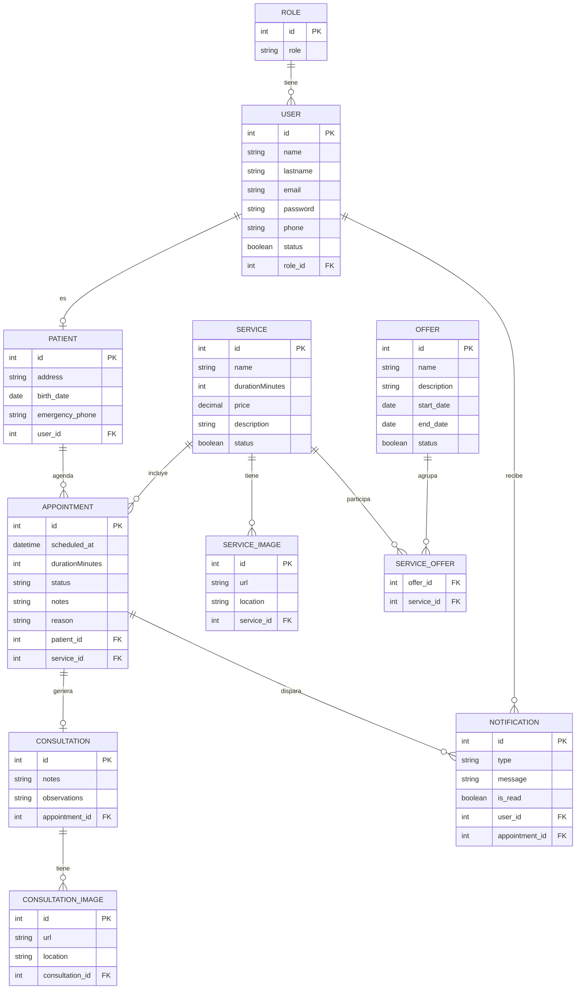

# Dentissa - Diagrama entidad-relación

```mermaid
erDiagram
  ROLE ||--o{ USER : tiene
  USER ||--o| PATIENT : es
  PATIENT ||--o{ APPOINTMENT : agenda
  SERVICE ||--o{ APPOINTMENT : incluye
  SERVICE ||--o{ SERVICE_IMAGE : tiene
  SERVICE ||--o{ SERVICE_OFFER : participa
  OFFER ||--o{ SERVICE_OFFER : agrupa
  APPOINTMENT ||--o| CONSULTATION : genera
  CONSULTATION ||--o{ CONSULTATION_IMAGE : tiene
  APPOINTMENT ||--o{ NOTIFICATION : dispara
  USER ||--o{ NOTIFICATION : recibe

  ROLE {
    int id PK
    string role
  }
  USER {
    int id PK
    string name
    string lastname
    string email
    string password
    string phone
    boolean status
    int role_id FK
  }
  PATIENT {
    int id PK
    string address
    date birth_date
    string emergency_phone
    int user_id FK
  }
  SERVICE {
    int id PK
    string name
    int durationMinutes
    decimal price
    string description
    boolean status
  }
  SERVICE_IMAGE {
    int id PK
    string url
    string location
    int service_id FK
  }
  APPOINTMENT {
    int id PK
    datetime scheduled_at
    int durationMinutes
    string status
    string notes
    string reason
    int patient_id FK
    int service_id FK
  }
  CONSULTATION {
    int id PK
    string notes
    string observations
    int appointment_id FK
  }
  CONSULTATION_IMAGE {
    int id PK
    string url
    string location
    int consultation_id FK
  }
  OFFER {
    int id PK
    string name
    string description
    date start_date
    date end_date
    boolean status
  }
  SERVICE_OFFER {
    int offer_id FK
    int service_id FK
  }
  NOTIFICATION {
    int id PK
    string type
    string message
    boolean is_read
    int user_id FK
    int appointment_id FK
  }
```
